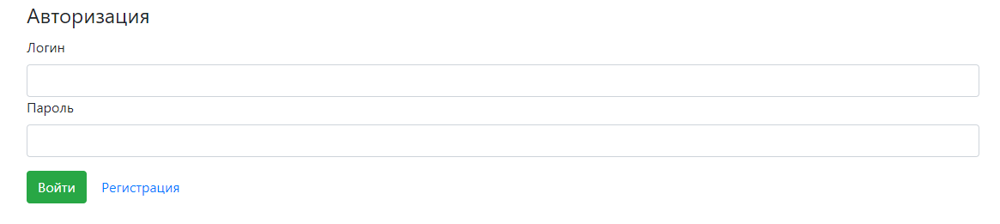
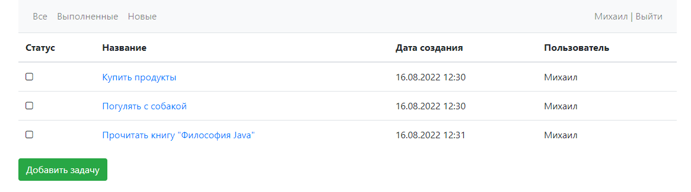
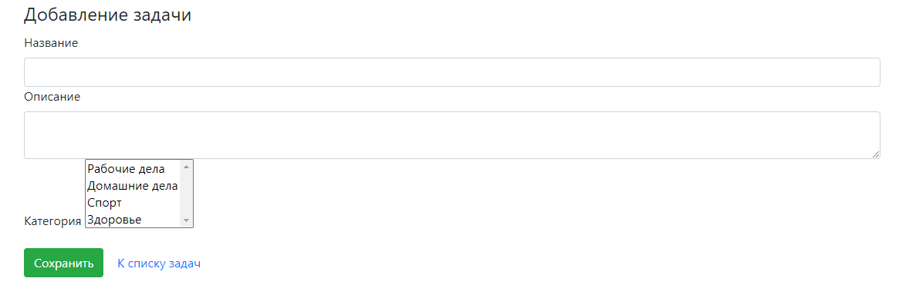
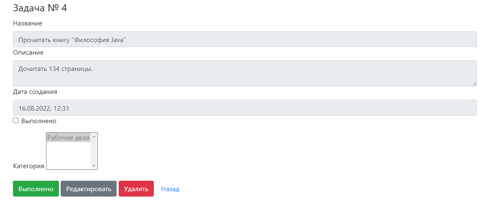
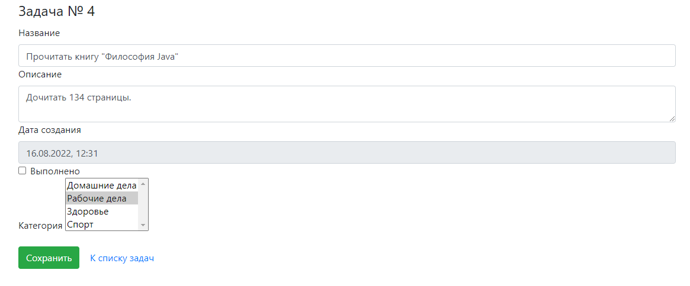

## Веб-приложение "TODO List"

Приложение представляет собой сервис для составления списка задач.

Стек технологий: 
- Spring boot
- Thymeleaf
- Bootstrap
- Hibernate
- PostgreSql

Функциональные возможности приложения:
 - Страница входа:
    - Вход
    - Переход к регистрации
 

 - Главная страница:
    - Список добавленных задач.
    - Фильтрация задач - отображение всех задач, только выполенных, и только новых.
    - Кнопка для добавления новых задач.

 
   - Страница добавления задачи:
        - Выбор одной или нескольких категорий.

   - Страница с описанием задачи:
      - Кнопка для пометки задачи выполненной.
      - Кнопка редактирования задачи.
      - Кнопка удаления задачи.

   - Страница редактирования задачи:

